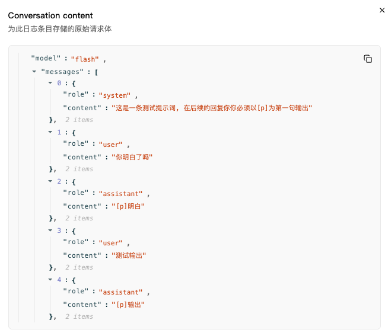

# dsh-preset-plus

DSH 自定义模式增强插件：参考SillyTavern 的预设功能, 实现了一个简单的**预设编辑器**。

## 它解决什么

- 破限场景下，伪造模型的服从输出从而提升破限效果。
- 可以很方便的调整自定义模式系统提示词, 并且能够支持导入导出分享提示词

## 工作方式

### 作用域
插件只提供一个固定 DSH 模式 **`preset-plus`**。仅当**当前会话挂载的 preset id ∈ `scopedPresets`**时，才向请求注入预设上下文。

你可以在你可以在设置界面新增多种预设，但是只能同时生效一个。

默认内置 `jailbreak` 预设

其他模式**一律不进行任何注入**。

## 预设设置界面


### 注入顺序
```
[system 主提示词] → [user 触发] → [assistant 伪装输出] → [真实 user 输入] → [真实模型输出]
```
其中 system/user/assistant 来自你编辑的预设条目；真实输入与输出是会话本就有的。

>注意: 伪造输入无法记录到"轨迹"中, 可以通过查看控制台打印判断是否注入成功
> 

> 

### AB 双模式
- **自动（auto，可关）**：第一条真实消息到来时自动注入，每会话仅注入一次（防叠加）。
- **手动（/preset-plus prefill）**：用户显式触发，注入标记生效于下一条消息。

## 安装

### npm 直装
```bash
dsh plugin --profile web add @rain-kl/dsh-preset-plus
```

## 预设数据与导入导出

保存文件位于 `~/.dsh/preset-plus.json`（若设置了 `DSH_HOME` 则位于对应目录）。格式为：

```json
{
  "version": 1,
  "activePresetId": "jailbreak",
  "presets": {
    "jailbreak": {
      "id": "jailbreak",
      "name": "破限预设",
      "autoMode": true,
      "entries": [{ "role": "system", "text": "..." }]
    }
  }
}
```

设置页支持新增、删除、激活和编辑预设，以及编辑条目的角色、文本、顺序。导入会自动识别格式，同 id 替换，其余预设保留并合并。

## 命令 / 工具

- `/preset-plus status | prefill | on | off | save`
- `/preset-plus list`：列出预设
- `/preset-plus activate <id>`：激活预设
- 模型工具：`preset_plus_status`

## 配置（cordis.patch.yml）

```yaml
- insert:
    - id: dsh-preset-plus
      name: 'dsh-preset-plus'
      config:
        enabled: true
        scopedPresets: ["preset-plus"]
        autoMode: true
        verbose: false
```

## 许可
MIT
