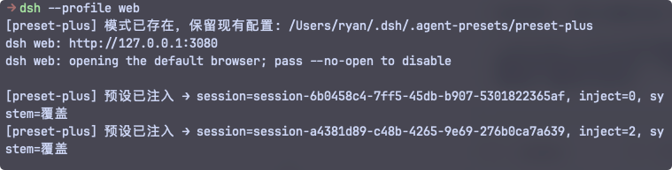
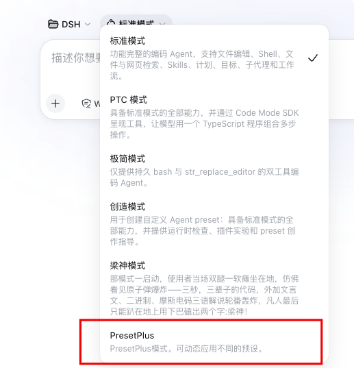

<div align="center">

# DSH-Preset-Plus

### DSH 预设增强插件

参考 SillyTavern 预设模功能开发的一个基础的**预设编辑器**。


<p>
  <a href="LICENSE"></a>
  <a href="https://nodejs.org/"></a>
  <a href="https://linux.do/"></a>
</p>


</div>

---

## 它解决什么

- 破限场景下，伪造模型的服从输出从而提升破限效果。
- 可以很方便的调整自定义模式系统提示词, 并且能够支持导入导出分享提示词

## 工作方式

### 作用域
插件只提供一个固定 DSH 模式 **`preset-plus`**。仅当**当前会话挂载的 preset id ∈ `scopedPresets`**时，才向请求注入预设上下文。

你可以在你可以在设置界面新增多种预设，但是只能同时生效一个。

默认内置 `jailbreak` 预设

其他模式**一律不进行任何注入**。

## 预设界面


### 注入顺序
```
[system 主提示词] → [user 触发] → [assistant 伪装输出] → [真实 user 输入] → [真实模型输出]
```
其中 system/user/assistant 来自你编辑的预设条目；真实输入与输出是会话本就有的。

>注意: 伪造输入无法记录到"轨迹"中, 可以通过查看控制台打印判断是否注入成功
> 


### AB 双模式
- **自动（auto，可关）**：第一条真实消息到来时自动注入。
- **手动（/preset-plus prefill）**：用户显式触发，注入标记生效于下一条消息。

## 命令 / 工具

- `/preset-plus status | prefill | on | off | save`
- `/preset-plus list`：列出预设
- `/preset-plus activate <id>`：激活预设
- 模型工具：`preset_plus_status`

---

## 快速开始

### Git (推荐)
```bash
dsh plugin --profile web add github:Rain-kl/dsh-preset-plus
```

### npm 仓库

```bash
#可能存在版本滞后
dsh plugin --profile web add @rain-kl/dsh-preset-plus
```

在设置里配置完预设后, 选择 PresetPlus 模式使用既可生效




---

## 友情链接 / Links

- [LinuxDo](https://linux.do)


## License

The [MIT License](LICENSE) allows use, modification, distribution, and commercial use.